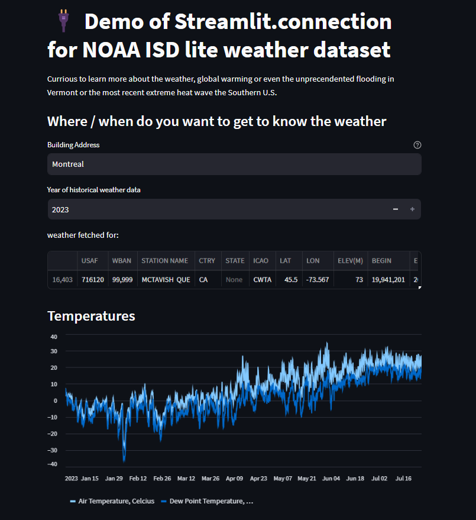

# noaa_isd_streamlit_connection

an example app with a demo of streamlit new connection feature to fetch data from NOAA Integrated surface dataset.


app is deployed at: https://noaaisdappconnexion.streamlit.app/.



## Installation

```
pip install git+https://github.com/plparadis/noaa_isd_streamlit_connexion
```


## Quick demonstration

```python
import streamlit as st
from noaa_isd_connection import NOAAisdWeatherDataConnection

address = st.text_input(label="Building Address", value="Montreal", help="Support address, city, zip code, etc.")
year = st.number_input(label="Year of historical weather data", value=datetime.date.today().year, max_value=datetime.date.today().year)
data = st.experimental_connection('weather_data', type=NOAAisdWeatherDataConnection, ttl=3600, address=address, year=year)
results = data.get(address=address, year=year)
eather_data = results["weather_data"]
station_info = results["station_info"]
st.line_chart(weather_data[['Air Temperature, Celcius',
       'Dew Point Temperature, Celcius']])
```


## Main methods
#### get()

`get(self, address: str, year: int, ttl: int = 3600, **kwargs) -> dict:`

- `address` - location to get the weather
- `year` - year of the weather data
- `ttl` - cache the response for `ttl` seconds

## Connection parameters
#### cursor(results)
Returns the raw file URL. 

